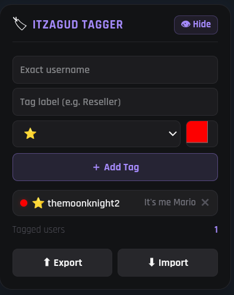

# ❤️‍🔥 ItzaGud Tagger (NeonScript)

A lightweight userscript to tag, highlight, and manage users on ItzaGud auctions — all in real-time with a sleek widget.

> **Inspired by:** [ItzaGudStats](https://github.com/MeguminShiro/itzagudstats) by MeguminShiro & [ItzaGudStats Fork](https://github.com/YLBlack/itzagudstats) by YLBlack

---

## GUI


*The draggable Neon-style widget for tagging users.*

---

### ✨ Features

- 🏷️ **Custom Tags** — Label any username (e.g. Reseller, Trusted, Scammer).
- 🎨 **Emoji + Color Badges** — Fully customizable and visually distinctive.
- 💡 **Neon Card Outlines** — Tagged sellers glow their badge color around the whole auction card. Tagged bidders get a tighter glow on their name button only.
- ⚡ **Real-Time Tagging** — Instantly updates badges as new auction cards load. Uses a batched `requestAnimationFrame` observer so it never lags.
- 🧠 **Smart Detection** — Matches on label text ("Seller" / "Highest Bidder") rather than DOM structure, so site updates don't break it.
- 💾 **Persistent Storage** — Tags and settings are saved via GM storage, which works in private and container tabs (unlike `localStorage`).
- ⚙️ **Font Size Slider** — Adjust the widget and badge text size from 9–18px, saved across sessions.
- 📋 **Import & Export** — Copy your tag list to clipboard or import from JSON to share or restore your tags.
- ✏️ **Edit Tags** — Click the pencil icon on any tag to load it back into the form and update it.
- 🖱️ **Draggable UI** — Minimal Neon-style widget, position saves across page loads.
- 👁️ **Toggle Visibility** — Show or hide the widget with a single click.

---

### 📋 Installation

1. Install a userscript manager:

- [Tampermonkey](https://www.tampermonkey.net/) *(recommended)*
- [Violentmonkey](https://violentmonkey.github.io/)
- [Greasemonkey](https://www.greasespot.net/)

2. Open the `itzagud-tagger.js` file in your browser.

3. The userscript manager will prompt you to install it.

4. Visit any ItzaGud auction page — the tag manager widget will appear automatically.

---


### 💡 Usage Tips

- Enter the **exact username** (case-insensitive) to ensure correct tagging.
- Use colors + emojis to differentiate user types at a glance — e.g. 🚩 red for scammers, ✅ green for trusted traders.
- Keep labels short for a cleaner widget list.
- Hit **Enter** in the name or label field to add a tag without reaching for the button.
- Use **Export** before clearing your browser data so you don't lose your tags.

---

### ⚙️ Customization

You can tweak badge styles and widget colors directly in the script. The main CSS variables are at the top of the style block:

```css
:root {
    --itz-bg:     rgba(9,9,11,0.88);   /* widget background */
    --itz-border: rgba(63,63,70,0.4);  /* border color */
    --itz-accent: #a78bfa;             /* purple accent */
    --itz-font:   'Rajdhani', sans-serif;
}
```

---

### 📝 Changelog

#### v1.1
- **Rebuilt seller/bidder detection** — the site switched to `<article>`-based auction cards. The old method walked up the DOM looking for a 3-column grid with a Steam CDN image, which broke. v1.1 now finds the "Seller" and "Highest Bidder" rows by their label text content instead, so site layout changes don't break it again.
- **Context-aware neon outlines** — tagged sellers glow the whole auction card; tagged bidders get a smaller glow on just their name button. Previously there was no outline at all.
- **GM storage instead of localStorage** — tags and settings now persist in private/container tabs where `localStorage` is blocked or sandboxed.
- **Font size slider in settings** — resize the widget and badges from 9 to 18px. Setting saves across sessions.
- **Edit button on tag list** — click ✏️ to load a tag back into the form for editing. Previously the only option was delete and re-add.
- **Broadened `@match`** — now runs on all `itzagud.net` pages instead of `/auctions*` only, so tags show up in chat, leaderboards, and anywhere else usernames appear.
- **`@run-at document-idle`** — boots after React finishes hydrating, fixing a race condition that caused the widget to occasionally not appear on first load.
- **`@noframes`** — prevents the script from running inside iframes on the page.

#### v1.0
- Initial release. Custom tags, emoji + color badges, draggable widget, export/import, real-time MutationObserver scanning.

---

### 🤝 Credits

- UI style inspired by [ItzaGudStats](https://github.com/MeguminShiro/itzagudstats) by MeguminShiro and its [fork](https://github.com/YLBlack/itzagudstats) by YLBlack.

---

### 📄 License

[CC BY 4.0](https://creativecommons.org/licenses/by/4.0/) — use it, fork it, share it, just keep the credit.
